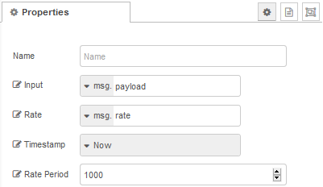
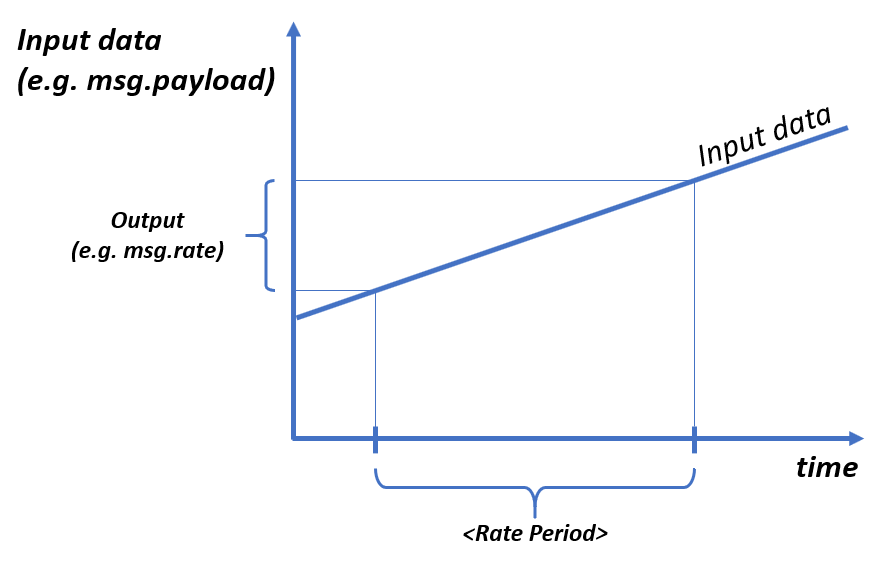
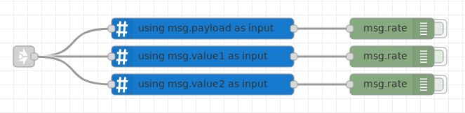
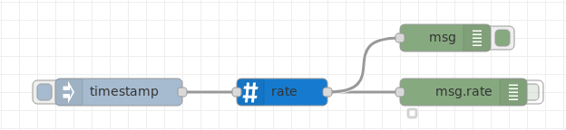
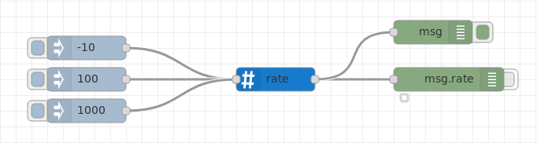

# node-red-contrib-rate

A Node-RED node for calculating the rate of change of a message property.

Rates of change are calculated based on the message property (`msg.topic`), so multiple topics can be passed through the node to calculate the individual rates of change for each topic.
The timebase can be chosen from *system time* (i.e. actual time of Node-RED) or to a timestamp given in the message containing the evaluated message topic.

  
**Fig. 1:** Node appearance

## Installation

### In Node-RED (preferred)
* Via Manage Palette -> Search for "node-red-contrib-rate"

### In a shell
* go to the Node-RED installation folder, e.g.: `~/.node-red`
* run `npm install node-red-contrib-rate`

## Usage

### Node Configuration

  
**Fig. 2:** Node properties (example hysteresis node)

#### Input
The input data to which the rate calulation refers can be selected to be a `msg` property, or a `flow` resp. `global` variable.  
With this option to choose the input property of a `msg` input, several `rate` nodes may be used in parallel (i.e. inputs connected to the identical node output) to get the rate of different properties of the same messages.

#### Rate
This is the output property name into which the node puts its rate calculation result for the chosen *Input* variable. This *Rate* property denotes the data at the nodes output messages.

#### Timestamp
The rate of change of the *Input* property data is related to a time (see also *Rate Period* below). It is calculated from the datapoints given by **[*Input* property; *Timestamp* property]**.

The Timestamp configuration describes instant of time to which the rate of change is related to:
- ***Now*** uses the current system time in milliseconds.  
- A ***property*** from the incoming `msg`, a flow or a global variable could be used for timestamping the input data.  

#### Rate Period
*Rate Period* specifies the number of timestamp units the rate of change is related.  
For example, if the timestamp is in milliseconds, *Rate Period* of 1000 would calculate the rate of change per second.  
See also  [Example 1](#timestamp_example1).

See also Fig. 3: The shorter the *Rate Period* value is, the smaller the output `msg.rate` will be.

**Fig. 3:** `Rate Period`

### Input
The input data will be taken from the incoming `msg`. It is possible to measure the rate of several values (properties) of an incoming `msg`, therefor the node configuration property *Input* is present.

**Fig. 4:** Evaluating several values from the same `msg`

**Input data values with own timestamp**  
If you have input messages containing their own timestamp information (e.g. because the data and timestamp were generated by a  value latching instance) the rate of change can be evaluated by using the message timestamp data as the *Timestamp* node configuration property. To achieve this, change the *Timestamp* node configuration property to the input `msg.property` where the timestamp value is located.

**Input data conversion**  
The format of the input data will be converted as possible. You may also use mixed input data types, e.g. numbers or strings with  the same rate node. This could be the case if the rate node is fed from different source nodes with different *Input* formats (like shown in [Example 2](#values_example2)).

### Output
The output is the rate of change of the *Input* data. It can be routed to any `output.msg` property, this is configured via the node configuration property *Rate*.

## Examples
***
**Remark**: Example flows are present in the examples subdirectory. In Node-RED they can be imported via the import function and then selecting *Examples* in the vertical tab menue.
***

### Example 1: Measuring the system timestamp
This example measures the timestamp of the system. The result should be a constant rate. Depending on the *Rate Period* value you get different rates due to a different measurement time references.  
Change the *Rate Period* of the rate node and examine what happens!

[**TimestampMeasuringFlow.json**](examples/TimestampMeasuringFlow.json)  

**Fig. 5:** Timestamp measuring example

### Example 2: Measuring value changes

[**ValueMeasuringFlow.json**](examples/ValueMeasuringFlow.json)  

**Fig. 6:** Value measuring example
